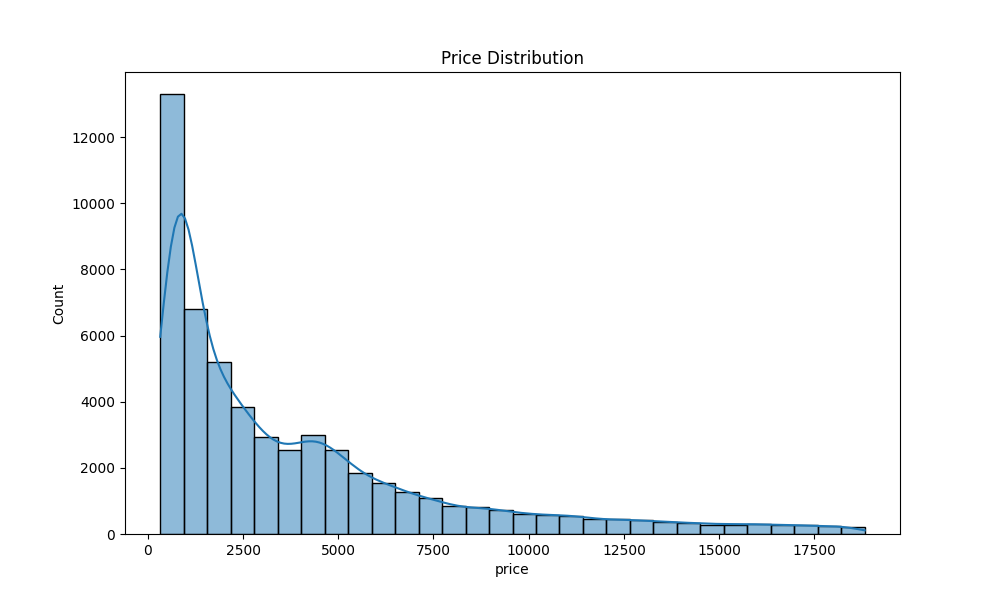
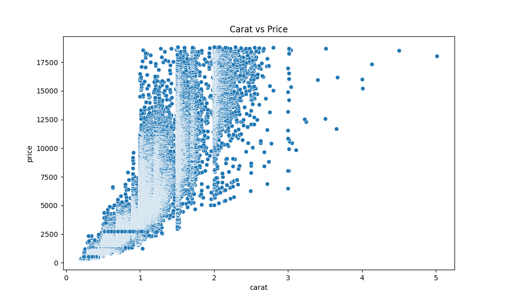
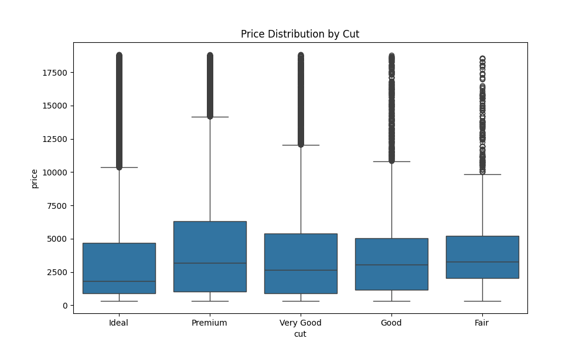
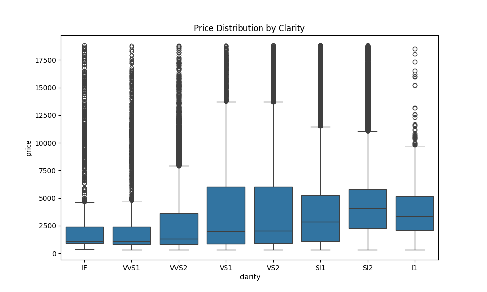

# EDA Report on Diamonds

## Basic Statistics
              carat         depth  ...             y             z
count  53940.000000  53940.000000  ...  53940.000000  53940.000000
mean       0.797940     61.749405  ...      5.734526      3.538734
std        0.474011      1.432621  ...      1.142135      0.705699
min        0.200000     43.000000  ...      0.000000      0.000000
25%        0.400000     61.000000  ...      4.720000      2.910000
50%        0.700000     61.800000  ...      5.710000      3.530000
75%        1.040000     62.500000  ...      6.540000      4.040000
max        5.010000     79.000000  ...     58.900000     31.800000

[8 rows x 7 columns]

## Visualizations

## Pivot Table
color                D            E  ...            I            J
cut                                  ...                          
Ideal      2629.094566  2597.550090  ...  4451.970377  4918.186384
Premium    3631.292576  3538.914420  ...  5946.180672  6294.591584
Very Good  3470.467284  3214.652083  ...  5255.879568  5103.513274
Good       3405.382175  3423.644159  ...  5078.532567  4574.172638
Fair       4291.061350  3682.312500  ...  4685.445714  4975.655462

[5 rows x 7 columns]
